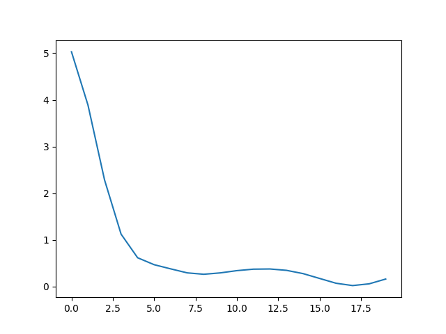

# Learning to learn by gradient descent by gradient descent

项目名称：Learning to learn by gradient descent by gradient descent 复现

参考论文：Learning to learn by gradient descent by gradient descent, 2016, NIPS

项目成员：唐雯豪(@thwfhk), 巫子辰(@SuzumeWu), 杜毕安(@scncdba), 王昕兆(@wxzsan)

项目地址：https://github.com/thwfhk/Learning-to-learn

指导成员：黄佳磊

## 要求

```
python 3.7
tensorflow 2.0
numpy 1.16.5
matplotlib 3.1.2
```

## 说明

本项目复现了论文中的第一个实验：训练一个**寻找多元二次函数最小值的优化器**

运行 `python train_optimizer.py` 或 `python train_optimizer_new.py` 来训练一个优化器

运行 `python test.py` 或 `python test_new.py` 来进行测试

**两者的不同：**
- 有`_new`后缀的是完全使用tensorflow2.0动态图的版本
- 没有`_new`后缀的测试部分使用了动态图，优化器训练部分使用了静态图（部分借鉴了[runopti的项目](https://github.com/runopti/Learning-To-Learn)）

本项目的代码逻辑可能和DeepMind官方项目有所不同，下面将详细说明：

### 训练优化器部分

- 每个 epoch 采样 num_samples 个数据，这些数据都是以同一个theta作为最小值点的 n_dimension 元二次函数

- 这些数据（函数），每个用待训练的优化器进行 n_unroll 次优化，每次优化后的loss加起来

- 所有数据的loss加起来平均作为这次的loss，使用这个loss来训练优化器

### 测试部分

- 共有 num_samples 个数据，每个 epoch 使用相同的数据；这些数据都是以同一个theta作为最小值点的 n_dimension 元二次函数

- 每个函数(数据)进行 unroll 次优化

- 每个 epoch 只有一个batch，就是把所有 num_samples 个函数的loss加起来作为总loss然后进行优化

- （有一个问题，这里测试显示每次清lstm的状态比不清要好QwQ）

### 其他

`MyModel`是优化器的目标模型，可以通过修改MyModel来使优化器适用于其他任务。

## 效果展示

当前复现的效果比SGD差一点。

使用lstm训练的优化器的优化效果:

使用SGD的优化效果：

## 引用

感谢 https://github.com/runopti/Learning-To-Learn